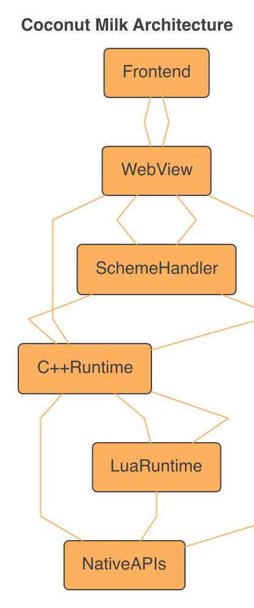
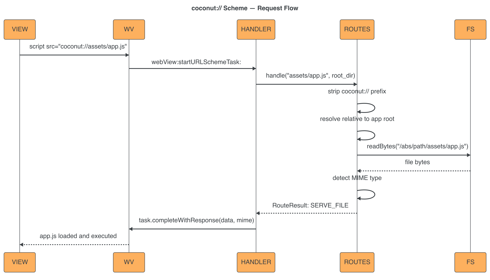
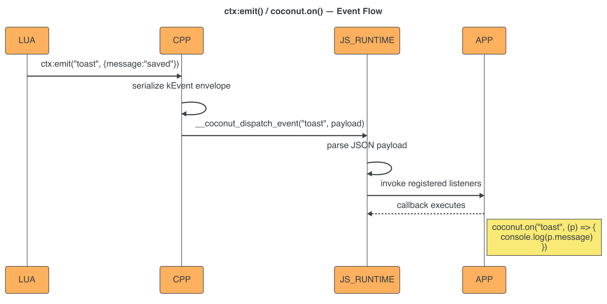
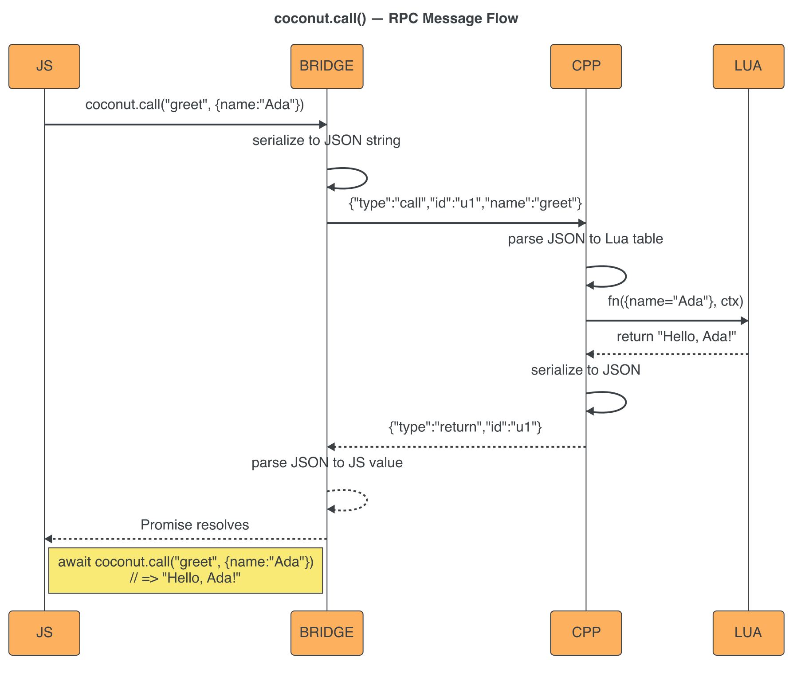

# Concepts

## Architecture

Coconut Milk uses a **layered architecture** with four main layers:



```
┌─────────────────────────────────────────────────────────────┐
│  Frontend (HTML/CSS/JS)                                     │
│  - Your app's UI (vanilla, Vue, React, Solid, Alpine.js)   │
│  - Uses coconut.call(), coconut.emit(), coconut.on()        │
└─────────────────────┬───────────────────────────────────────┘
                      │
                      ▼
┌─────────────────────────────────────────────────────────────┐
│  WebView (WKWebView / WebView2 / WebKitGTK)                 │
│  - Renders HTML, executes JS                                 │
│  - Handles coconut:// scheme requests                        │
│  - Injects coconut JS API globally                           │
└─────────────────────┬───────────────────────────────────────┘
                      │
                      ▼
┌─────────────────────────────────────────────────────────────┐
│  C++ Runtime (bridge, routes, config)                       │
│  - RPC message dispatch                                     │
│  - Route resolution (views, files, 404)                     │
│  - Transport layer (webview binding)                        │
└─────────────────────┬───────────────────────────────────────┘
                      │
                      ▼
┌─────────────────────────────────────────────────────────────┐
│  Lua Runtime (LuaJIT + sol2 bindings)                       │
│  - Command handlers (commands/*.lua)                        │
│  - View lifecycle callbacks                                 │
│  - Event dispatch (coconut.events)                          │
└─────────────────────┬───────────────────────────────────────┘
                      │
                      ▼
┌─────────────────────────────────────────────────────────────┐
│  Native APIs (platform-specific)                            │
│  - File system (read, write, listDir)                       │
│  - Dialogs (open, save, messageBox)                         │
│  - Window (size, frameless, transparent, close)             │
└─────────────────────────────────────────────────────────────┘
```

### Data Flow

1. **User interacts with the UI** (clicks a button, submits a form)
2. **Frontend JS calls `coconut.call("command_name", payload)`**
3. **WebView sends an RPC message to C++** (JSON string via `webview_bind`)
4. **C++ dispatches to Lua** via sol2 bindings
5. **Lua command handler runs** and returns a value (or emits events)
6. **C++ serializes the result** back to JSON
7. **WebView delivers the response** to the frontend
8. **Frontend Promise resolves** with the return value

---

## View System

### Named Views

All views are **named** and registered in `coconut.views()`:

```lua
function coconut.views()
  return {
    home = View.load("views/home.html"),
    settings = View.load("views/settings.html"),
    about = View.html("<h1>About</h1>"),
    external = View.url("https://example.com"),
  }
end
```

View names are used for:
- **Initial view selection** (`setInitialView("home")`)
- **View switching** (`ctx:show("settings")`)
- **Internal routing** (`coconut://view_name` links)
- **Lifecycle callbacks** (attached per-view)

### View Factories

| Factory | Description | Example |
|---|---|---|
| `View.load(path)` | Load from a local HTML file | `View.load("views/home.html")` |
| `View.html(html)` | Inline HTML string | `View.html("<h1>Hello</h1>")` |
| `View.url(url)` | External URL | `View.url("https://example.com")` |

### View Lifecycle Callbacks

Each view descriptor supports lifecycle methods:

```lua
function coconut.views()
  return {
    home = View.load("views/home.html")
      :on_load(function(ctx)
        -- Called ONCE when the view is first created
        print("Home view loaded")
      end)
      :on_mount(function(ctx)
        -- Called EVERY TIME the view becomes visible
        print("Home view is now visible")
      end)
      :on_unmount(function(ctx)
        -- Called EVERY TIME the view is hidden
        print("Home view is hidden")
      end)
      :on_frontend_event("navigate", function(name, payload, ctx)
        -- Called when frontend emits this event while view is active
        if payload.view then
          ctx:show(payload.view)
        end
      end),
  }
end
```

| Callback | When Called | Use Case |
|---|---|---|
| `on_load` | Once, when the view descriptor is first used | Initialize data, load config |
| `on_mount` | Every time the view becomes active | Focus input, start timer |
| `on_unmount` | Every time the view is hidden | Stop timer, save state |
| `on_frontend_event` | When frontend emits a matching event | Handle navigation, toasts |

### View Switching

Switch views with `ctx:show(name)`:

```lua
-- From Lua:
ctx:show("settings")

-- From frontend:
await coconut.call("navigate", { view: "settings" })
-- Or using the built-in event system:
await coconut.emit("navigate", { view: "settings" })
```

---

## The coconut:// Scheme

The `coconut://` custom URL scheme is the primary way to reference assets in your views. It provides **portable, filesystem-independent paths** that resolve relative to the app root.

### Why coconut://?

Without a custom scheme, file-based views served via `file://` resolve relative paths from the HTML file's directory. This forces fragile relative paths:

```html
<!-- Without coconut:// — breaks if views are reorganized -->
<link rel="stylesheet" href="../assets/style.css">
<script src="../assets/app.js"></script>
```

With `coconut://`, paths are always relative to the app root:

```html
<!-- With coconut:// — always works -->
<link rel="stylesheet" href="coconut://assets/style.css">
<script src="coconut://views/app.js"></script>

```

### How It Works



1. **HTML requests `coconut://assets/app.js`** — The browser (WKWebView) recognizes the custom scheme
2. **WKWebView calls the scheme handler** — `webView:startURLSchemeTask:` is invoked on `CoconutSchemeHandler`
3. **Handler delegates to `routes::resolve()`** — The platform-agnostic route resolver strips the `coconut://` prefix and resolves the path
4. **File is read from disk** — `coconut::fs::readBytes()` reads the file from the absolute path
5. **MIME type is detected** — Based on file extension (`.js` → `text/javascript`, `.css` → `text/css`, etc.)
6. **Response is sent to WKWebView** — The handler completes the `WKURLSchemeTask` with the file data and MIME type
7. **Asset loads in the page** — The browser processes the response as if it came from a normal HTTP server

### Path Resolution

```
coconut://assets/style.css
  → strip "coconut://" → "assets/style.css"
  → resolve relative to app root → "/abs/path/to/app/assets/style.css"
  → read file → return bytes
```

The **app root** is the current working directory when `coconut` is launched:

```bash
cd /path/to/my-app
coconut
# App root = /path/to/my-app
# coconut://assets/style.css → /path/to/my-app/assets/style.css
```

### URL View Routing

The scheme handler also handles **view navigation** via `coconut://view_name`:

```html
<!-- Navigate to the "settings" view -->
<a href="coconut://settings">Settings</a>
```

When the handler detects that the path matches a registered view name:

1. **No file is served** — Instead, JavaScript is evaluated in the webview:
   ```js
   coconut.emit('navigate', { view: 'settings' })
   ```
2. **A 204 No Content response is returned** — No flash, no page reload
3. **The Lua event handler processes the navigation** — `ctx:show("settings")` is called

This allows seamless view switching without leaving the webview context.

### MIME Type Detection

The handler maps file extensions to MIME types:

| Extension | MIME Type |
|---|---|
| `.css` | `text/css` |
| `.js` | `text/javascript` |
| `.html` | `text/html` |
| `.json` | `application/json` |
| `.png` | `image/png` |
| `.jpg`, `.jpeg` | `image/jpeg` |
| `.gif` | `image/gif` |
| `.svg` | `image/svg+xml` |
| `.ico` | `image/x-icon` |
| `.woff` | `font/woff` |
| `.woff2` | `font/woff2` |
| `.ttf` | `font/ttf` |
| `.map` | `application/json` |
| Other | `application/octet-stream` |

### Platform Support

| Platform | Status | Mechanism |
|---|---|---|
| **macOS** | ✅ Full | `WKURLSchemeHandler` registered on `WKWebViewConfiguration` |
| **Windows** | 🔲 Stub | `CoreWebView2.WebResourceRequested` (not implemented) |
| **Linux** | 🔲 Stub | `webkit_web_context_register_uri_scheme()` (not implemented) |

### Priority Order

When resolving a `coconut://` URL, the handler checks in this order:

1. **View name match** — If the path matches a registered view name, trigger navigation (204 response)
2. **File exists** — If the resolved file path exists on disk, serve the file
3. **Not found** — Return 404 if neither matches

### CORS and Sub-resources

Sub-resources (CSS, JS, images) loaded from `coconut://` work without CORS issues because **WKWebView scheme handler responses are in-process** — they don't go through the network stack.

**Important caveat:** `type="module"` ESM scripts from `coconut://` are still CORS-restricted when the page loads from `file://`. Use **IIFE bundles** with plain `<script>` tags to avoid this.

---

## Event Model

Coconut uses a **pub/sub event system** that works in both directions:

### Lua → Frontend

```lua
-- Lua emits an event
ctx:emit("toast", { message = "Saved successfully!", type = "success" })
```

```js
// Frontend listens for the event
coconut.on("toast", (payload) => {
  showToast(payload.message, payload.type)
})
```



### Frontend → Lua

```js
// Frontend emits an event
await coconut.emit("navigate", { view: "settings" })
```

```lua
-- Global event dispatcher
function coconut.events(name, payload, ctx)
  if name == "navigate" then
    ctx:show(payload.view)
  end
end
```

### emit vs emit_sync

| Method | Behavior | Use Case |
|---|---|---|
| `ctx:emit(name, payload)` | Async, queue-based, non-blocking | Normal events (toasts, updates) |
| `ctx:emit_sync(name, payload)` | Blocking, immediate delivery | Critical events that must be delivered now |

### Event Queuing

Before the bridge is ready (`coconut.ready()` hasn't resolved):

- **Events are queued** in order — they're delivered once the bridge is ready
- **Command calls wait** — `coconut.call()` blocks until readiness
- **Queue overflow** — If the queue fills up before readiness, the runtime rejects with `QueueOverflow`

### Event Namespaces

Command names and event names are in **separate namespaces**:

```lua
-- This works — same name in both namespaces:
ctx:bind("click", handler)        -- Command namespace
ctx:emit("click", { x = 10 })     -- Event namespace
```

However, using the same name in both namespaces is discouraged for clarity.

---

## Bridge Protocol

All communication between the frontend and the Lua backend uses a **canonical RPC envelope**:

### Message Types

| Type | Direction | Purpose |
|---|---|---|
| `call` | Frontend → Lua | Invoke a registered command |
| `return` | Lua → Frontend | Successful response to a call |
| `error` | Lua → Frontend | Error response to a call |
| `event` | Either direction | Fire-and-forget event |
| `ready` | Frontend → C++ | Bridge initialization handshake |

### JSON Envelope Shape

```json
// Call: Frontend → Lua
{ "type": "call",   "id": "uuid", "name": "greet", "payload": { "name": "Ada" } }

// Return: Lua → Frontend
{ "type": "return", "id": "uuid", "payload": { "greeting": "Hello, Ada!" } }

// Error: Lua → Frontend
{ "type": "error",  "id": "uuid", "payload": { "code": "CommandNotFound", "message": "No handler for 'unknown'" } }

// Event: Either direction
{ "type": "event", "name": "toast", "payload": { "message": "Saved!" } }

// Ready: Frontend → C++
{ "type": "ready" }
```

### Envelope Rules

- `id` is required for `call`, `return`, and `error` (used for Promise tracking)
- `name` is required for `call` (command name) and `event` (event name)
- `payload` is any JSON value (object, array, or primitive)
- `ready` has no `id` and carries no payload

### Readiness Handshake



1. **C++ creates the bridge** and loads the frontend
2. **Frontend bridge script initializes** and sends `{ "type": "ready" }`
3. **C++ acknowledges** — the bridge is now active
4. **Queued events are delivered**, waiting command calls proceed

---

## Config System

Coconut supports **two config sources** that are merged at startup:

### 1. coconut.config.lua (optional)

```lua
return {
  window_width = 1280,
  window_height = 640,
  window_min_width = 800,
  window_min_height = 600,
  window_max_width = 1920,
  window_max_height = 1080,
  initial_view = "home",
  title = "My App",
  frameless = false,
  transparent = false,
  resizable = true,
  view_root = "views",
  asset_root = "assets",
  command_root = "commands",
  generators = {
    output_dir = "generated"
  },
}
```

### 2. coconut.config(ctx) callback (required)

```lua
function coconut.config(ctx)
  return ctx
    :setWindowSize({ w = 1280, h = 640 })
    :setInitialView("home")
    :setTitle("My App")
end
```

**Priority:** The `ctx` callback **overrides** values from `coconut.config.lua`. The file provides defaults, the callback provides runtime configuration.

### Debug Config

The `debug` section controls logging:

```lua
return {
  debug = {
    enabled = true,          -- Enable debug output
    showTransportDump = false, -- Dump all RPC messages (verbose!)
    logLevel = "info",       -- "debug", "info", "warn", "error"
  },
}
```

| Level | Shows |
|---|---|
| `debug` | All messages including `[DEBUG]` |
| `info` | `[INFO]`, `[WARN]`, `[ERROR]` (default) |
| `warn` | `[WARN]`, `[ERROR]` |
| `error` | Only `[ERROR]` |

---

## Platform Support

### macOS

| Feature | Status | Notes |
|---|---|---|
| WebView | ✅ WKWebView | Native macOS webview |
| coconut:// scheme | ✅ Full | `WKURLSchemeHandler` |
| Frameless window | ✅ Full | `NSFullSizeContentViewWindowMask` + `titlebarAppearsTransparent` |
| Transparent background | ✅ Full | `setTransparent(true)` |
| Native dialogs | ✅ Full | `NSOpenPanel`, `NSSavePanel`, `NSAlert` |
| Filesystem | ✅ Full | `fs.readText`, `fs.writeText`, `fs.listDir` |
| Traffic light hiding | ✅ Full | View hierarchy traversal |

### Windows

| Feature | Status | Notes |
|---|---|---|
| WebView | ✅ WebView2 | Requires Microsoft Edge WebView2 runtime |
| coconut:// scheme | 🔲 Stub | `WebResourceRequested` not implemented |
| Frameless window | 🔲 Stub | Not implemented |
| Transparent background | 🔲 Stub | Not implemented |
| Native dialogs | ✅ Full | Win32 common dialogs |
| Filesystem | ✅ Full | Same API as macOS |

### Linux

| Feature | Status | Notes |
|---|---|---|
| WebView | ✅ WebKitGTK | Requires `libwebkit2gtk-4.1` |
| coconut:// scheme | 🔲 Stub | `webkit_web_context_register_uri_scheme` not implemented |
| Frameless window | 🔲 Stub | Not implemented |
| Transparent background | 🔲 Stub | Not implemented |
| Native dialogs | ✅ Full | GTK dialogs |
| Filesystem | ✅ Full | Same API as macOS |

---

## Next Steps

- Follow the **[Lua Backend Guide](./lua-guide.md)** for command patterns
- Read the **[Bridge (Advanced)](./bridge.md)** for protocol details
- Check the **[API Reference](./api-reference.md)** for all functions
