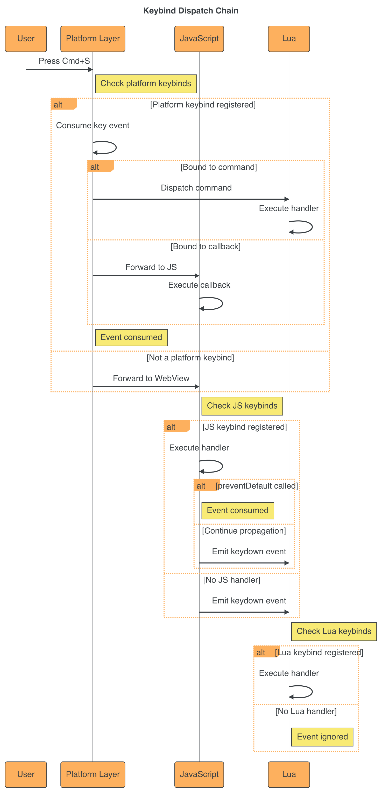

# How to: Use Keybinds

This guide shows you how to implement keyboard shortcuts in your Coconut Milk app using the `coconut.keybind()` API.

---

## What you'll learn

- Register basic keybinds (save, copy, paste)
- Create view-specific keybinds
- Handle platform differences (macOS vs Windows/Linux)
- Unregister keybinds dynamically
- Implement common patterns (undo/redo, navigation)

---

## How keybinds work

Before diving into examples, it's helpful to understand how keybinds flow through the system:

<p align="center">
  
</p>

<br>

The keybind system processes keyboard shortcuts through multiple layers, allowing platform-specific handling and fallback behavior.

---

## Basic keybinds

### Save (Cmd+S / Ctrl+S)

The most common keybind. Use `mod+s` which automatically maps to `cmd+s` on macOS and `ctrl+s` on other platforms.

**Lua:**

```lua
coconut.keybind("mod+s", function()
  -- Save current document
  local content = getCurrentContent()
  coconut.fs.writeText(currentFile, content)
  ctx:emit({ name = "save_complete" })
end, { 
  id = "editor.save",
  desc = "Save the current file"
})
```

**JavaScript:**

```js
coconut.keybind("mod+s", async () => {
  // Save current document
  const content = getCurrentContent()
  await coconut.call("fs_write_text", { 
    path: currentFile, 
    content 
  })
  coconut.emit({ name: "save_complete" })
}, { 
  id: "editor.save",
  desc: "Save the current file"
})
```

**Key points:**
- `mod` is a cross-platform modifier (cmd on macOS, ctrl elsewhere)
- `id` makes the keybind overridable and identifiable
- `desc` appears in the command palette

---

### Copy and Paste

**Lua:**

```lua
-- Copy
coconut.keybind("mod+c", function()
  local text = getSelectedText()
  coconut.clipboard.writeText(text)
end, { id = "edit.copy" })

-- Paste
coconut.keybind("mod+v", function()
  local text = coconut.clipboard.readText()
  insertTextAtCursor(text)
end, { id = "edit.paste" })
```

**JavaScript:**

```js
// Copy
coconut.keybind("mod+c", async () => {
  const text = getSelectedText()
  await coconut.call("clipboard_write", { text })
}, { id: "edit.copy" })

// Paste
coconut.keybind("mod+v", async () => {
  const result = await coconut.call("clipboard_read")
  if (result.text) {
    insertTextAtCursor(result.text)
  }
}, { id: "edit.paste" })
```

---

### Undo and Redo

**Lua:**

```lua
-- Undo
coconut.keybind("mod+z", function()
  undo()
end, { id = "edit.undo" })

-- Redo (Cmd+Shift+Z / Ctrl+Shift+Z)
coconut.keybind("mod+shift+z", function()
  redo()
end, { id = "edit.redo" })
```

**JavaScript:**

```js
// Undo
coconut.keybind("mod+z", () => {
  undo()
}, { id: "edit.undo" })

// Redo
coconut.keybind("mod+shift+z", () => {
  redo()
}, { id: "edit.redo" })
```

---

## View-specific keybinds

Scope keybinds to specific views so they only fire when that view is active.

### Editor view shortcuts

**Lua:**

```lua
function coconut.views()
  return {
    editor = View.load("views/editor.html")
      :on_mount(function()
        -- Register editor-specific keybinds
        coconut.keybind("mod+s", saveFile, { 
          id = "editor.save",
          scope = "editor"
        })
        
        coconut.keybind("mod+shift+f", formatCode, { 
          id = "editor.format",
          scope = "editor",
          desc = "Format code"
        })
      end)
      :on_unmount(function()
        -- Keybinds with scope automatically deactivate
        -- when view unmounts, but you can also unregister manually
      end)
  }
end
```

**JavaScript:**

```js
await coconut.ready()

coconut.on("view:editor:mount", () => {
  // Register editor-specific keybinds
  coconut.keybind("mod+s", saveFile, { 
    id: "editor.save",
    scope: "editor"
  })
  
  coconut.keybind("mod+shift+f", formatCode, { 
    id: "editor.format",
    scope: "editor",
    desc: "Format code"
  })
})
```

**Key points:**
- `scope` restricts keybind to a specific view
- Scoped keybinds automatically deactivate when the view unmounts
- Use `scope = "global"` for app-wide keybinds (default)

---

## Global app keybinds

### Command Palette (Cmd+Shift+P / Ctrl+Shift+P)

**Lua:**

```lua
coconut.keybind("mod+shift+p", function()
  ctx:emit({ name = "palette:open" })
end, { 
  id = "app.palette",
  desc = "Open command palette"
})
```

**JavaScript:**

```js
coconut.keybind("mod+shift+p", () => {
  coconut.emit({ name: "palette:open" })
}, { 
  id: "app.palette",
  desc: "Open command palette"
})
```

---

### Reload View (Cmd+R / Ctrl+R)

**Lua:**

```lua
coconut.keybind("mod+r", function()
  ctx:reload()
end, { 
  id = "app.reload",
  desc = "Reload current view"
})
```

**JavaScript:**

```js
coconut.keybind("mod+r", async () => {
  await coconut.call("reload")
}, { 
  id: "app.reload",
  desc: "Reload current view"
})
```

---

### Toggle Dev Tools (Cmd+Shift+I / Ctrl+Shift+I)

**Lua:**

```lua
coconut.keybind("mod+shift+i", function()
  ctx.window:toggleDevTools()
end, { 
  id = "app.devtools",
  desc = "Toggle developer tools"
})
```

**JavaScript:**

```js
coconut.keybind("mod+shift+i", async () => {
  await coconut.call("toggle_devtools")
}, { 
  id: "app.devtools",
  desc: "Toggle developer tools"
})
```

---

## Platform-specific keybinds

Some keybinds differ between platforms. Use the object syntax to specify per-platform combos.

### Close Window (Cmd+W on macOS, Alt+F4 on Windows/Linux)

**Lua:**

```lua
coconut.keybind({
  mac = "mod+w",
  win = "alt+f4",
  linux = "alt+f4"
}, function()
  ctx:close()
end, { 
  id = "app.close",
  desc = "Close window"
})
```

**JavaScript:**

```js
coconut.keybind({
  mac: "mod+w",
  win: "alt+f4",
  linux: "alt+f4"
}, async () => {
  await coconut.call("close")
}, { 
  id: "app.close",
  desc: "Close window"
})
```

**Key points:**
- Object syntax allows explicit per-platform combos
- `mac`, `win`, `linux` keys are optional
- Falls back to default if platform not specified

---

### Quit App (Cmd+Q on macOS, Alt+F4 on Windows/Linux)

**Lua:**

```lua
coconut.keybind({
  mac = "mod+q",
  win = "alt+f4",
  linux = "alt+f4"
}, function()
  ctx:emit({ name = "app:quit" })
end, { 
  id = "app.quit",
  desc = "Quit application"
})
```

**JavaScript:**

```js
coconut.keybind({
  mac: "mod+q",
  win: "alt+f4",
  linux: "alt+f4"
}, () => {
  coconut.emit({ name: "app:quit" })
}, { 
  id: "app.quit",
  desc: "Quit application"
})
```

---

## Unregistering keybinds

`coconut.keybind()` returns an unregister function. Call it to remove the keybind.

### Conditional keybinds

**Lua:**

```lua
local unregisterEditMode = nil

function enterEditMode()
  -- Register edit-mode keybinds
  unregisterEditMode = coconut.keybind("escape", function()
    exitEditMode()
  end, { id = "edit.escape" })
  
  coconut.keybind("mod+a", selectAll, { id = "edit.select_all" })
end

function exitEditMode()
  -- Unregister edit-mode keybinds
  if unregisterEditMode then
    unregisterEditMode()
    unregisterEditMode = nil
  end
end
```

**JavaScript:**

```js
let unregisterEditMode = null

function enterEditMode() {
  // Register edit-mode keybinds
  unregisterEditMode = coconut.keybind("escape", () => {
    exitEditMode()
  }, { id: "edit.escape" })
  
  coconut.keybind("mod+a", selectAll, { id: "edit.select_all" })
}

function exitEditMode() {
  // Unregister edit-mode keybinds
  if (unregisterEditMode) {
    unregisterEditMode()
    unregisterEditMode = null
  }
}
```

---

## Common patterns

### Navigation (Cmd+1, Cmd+2, etc.)

**Lua:**

```lua
-- Switch to view 1, 2, 3... with Cmd+1, Cmd+2, etc.
for i = 1, 9 do
  coconut.keybind("mod+" .. i, function()
    ctx:emit({ name = "navigate", view = "tab" .. i })
  end, { 
    id = "app.tab" .. i,
    desc = "Switch to tab " .. i
  })
end
```

**JavaScript:**

```js
// Switch to view 1, 2, 3... with Cmd+1, Cmd+2, etc.
for (let i = 1; i <= 9; i++) {
  coconut.keybind(`mod+${i}`, () => {
    coconut.emit({ name: "navigate", view: `tab${i}` })
  }, { 
    id: `app.tab${i}`,
    desc: `Switch to tab ${i}`
  })
}
```

---

### Zoom In/Out (Cmd++, Cmd+-, Cmd+0)

**Lua:**

```lua
-- Zoom in
coconut.keybind("mod+=", function()  -- = is the unshifted + key
  zoomIn()
end, { id = "view.zoom_in", desc = "Zoom in" })

-- Zoom out
coconut.keybind("mod+-", function()
  zoomOut()
end, { id = "view.zoom_out", desc = "Zoom out" })

-- Reset zoom
coconut.keybind("mod+0", function()
  resetZoom()
end, { id = "view.zoom_reset", desc = "Reset zoom" })
```

**JavaScript:**

```js
// Zoom in
coconut.keybind("mod+=", () => {  // = is the unshifted + key
  zoomIn()
}, { id: "view.zoom_in", desc: "Zoom in" })

// Zoom out
coconut.keybind("mod+-", () => {
  zoomOut()
}, { id: "view.zoom_out", desc: "Zoom out" })

// Reset zoom
coconut.keybind("mod+0", () => {
  resetZoom()
}, { id: "view.zoom_reset", desc: "Reset zoom" })
```

---

### Arrow key navigation

**Lua:**

```lua
-- Navigate with arrow keys
coconut.keybind("up", function()
  moveSelection(-1, 0)
end, { id = "nav.up" })

coconut.keybind("down", function()
  moveSelection(1, 0)
end, { id = "nav.down" })

coconut.keybind("left", function()
  moveSelection(0, -1)
end, { id = "nav.left" })

coconut.keybind("right", function()
  moveSelection(0, 1)
end, { id = "nav.right" })
```

**JavaScript:**

```js
// Navigate with arrow keys
coconut.keybind("up", () => {
  moveSelection(-1, 0)
}, { id: "nav.up" })

coconut.keybind("down", () => {
  moveSelection(1, 0)
}, { id: "nav.down" })

coconut.keybind("left", () => {
  moveSelection(0, -1)
}, { id: "nav.left" })

coconut.keybind("right", () => {
  moveSelection(0, 1)
}, { id: "nav.right" })
```

---

## Available modifiers and keys

### Modifiers

| Modifier | macOS | Windows/Linux | Usage |
|----------|-------|---------------|-------|
| `mod` | Cmd | Ctrl | Cross-platform primary modifier |
| `cmd` | Cmd | - | macOS only |
| `ctrl` | Ctrl | Ctrl | Explicit control key |
| `alt` | Alt/Option | Alt | Secondary modifier |
| `shift` | Shift | Shift | Tertiary modifier |

### Keys

| Category | Keys |
|----------|------|
| Letters | `a` through `z` |
| Numbers | `0` through `9` |
| Function | `f1` through `f20` |
| Arrows | `up`, `down`, `left`, `right` |
| Special | `space`, `enter`, `tab`, `escape`, `backspace`, `delete` |
| Symbols | `=`, `-`, `[`, `]`, `\\`, `;`, `'`, `,`, `.`, `/` |

---

## Best practices

1. **Use `mod` for cross-platform keybinds** - Automatically maps to the platform's primary modifier
2. **Provide `id` and `desc`** - Makes keybinds discoverable in the command palette
3. **Use `scope` for view-specific keybinds** - Prevents conflicts between views
4. **Unregister dynamic keybinds** - Clean up keybinds when they're no longer needed
5. **Avoid conflicts with system shortcuts** - Don't override Cmd+C/V/X, Cmd+Q, etc. unless intentional
6. **Test on all platforms** - Verify keybinds work on macOS, Windows, and Linux

---

## Next steps

- See the [Keybind Specification](../reference/specs/keybind-spec.md) for complete technical details
- Learn about [Event Handling Patterns](./how-to-events.md) for responding to keybind events
- Check [API Reference: coconut.keybind()](../reference/api-reference.md#coconutkeybind) for full signature
