---

layout: default

title: Diagrams

parent: Explanation

nav_order: 9

description: Sequence and component diagrams of Coconut Milk's systems, modules, and classes.

---

# 🗺️ System Diagrams

> ⚠️ **Partially outdated**: the Background Command Execution section describes the
> retired `bg_thread` + `Outbox` machinery. Current flow: commands route through
> `core::Bridge::onInbound` → sync executor or `core::Dispatcher` → WorkerPool,
> with RpcId-correlated async envelopes. See
> `docs/architecture/coconut_sequence_command_result.svg` for the live sequence.

Sequence and component diagrams of Coconut Milk's **systems**, **modules**, and **classes**.

All diagrams are authored in [Pintora](https://pintora.io) (`.pintora` source in this

directory) and rendered to PNG alongside the source.

> Source files live in [`docs/diagrams/`](.) — re-render with

> `pintora render -i <name>.pintora -o <name>.png` (pixel-ratio 2).

## Runtime Lifecycle

| Diagram | What it shows |

|---|---|

| [Startup](#startup) | Full bootstrap: CLI → config → `app::create` → Lua runtime → transport → views → run loop. |

| [Shutdown](#shutdown) | Ordered teardown in `app::destroy` and why the order matters. |

| [Config Resolution](#config-resolution) | Layered config: defaults → `coconut.config.lua/json` → CLI overrides → `ctx` setters. |

## Bridge & Commands

| Diagram | What it shows |

|---|---|

| [Command Dispatch (Main Thread)](#command-dispatch-main-thread) | `coconut.call()` → `WebviewTransport::handleCall` → registry → `webview_return`. |

| [Background Command Execution](#background-command-execution) | `bg_thread::Context` + lock-free `Outbox` round trip (machinery present; activation wiring in v0.2.0). |

| [Bridge Communication](#bridge-communication) | Lua ↔ JS in both directions, including the error flow. |

| [RPC Call](#rpc-call) | Conceptual `coconut.call()` envelope flow. |

## Views & Events

| Diagram | What it shows |

|---|---|

| [View Switching](#view-switching) | `ctx.window.show()` with `mount`/`unmount` lifecycle events through the dispatch queue. |

| [Event Flow](#event-flow) | `ctx:emit()` → JS listeners. |

| [Event Dispatch Chain](#event-dispatch-chain) | Three-tier chain: `view:on` → `coconut.on` → `coconut.events`. |

| [Keybind Dispatch](#keybind-dispatch) | Platform → JS → Lua keybind routing. |

## Platform & Tooling

| Diagram | What it shows |

|---|---|

| [Window Control](#window-control) | `CoconutWindowHandle` → window interface → platform impl (adapter rule). |

| [Platform Adapter](#platform-adapter) | Lua module → C++ interface → per-OS impl, with background-thread stubs. |

| [Scheme Flow](#scheme-flow) | `coconut://` URL → file serving. |

| [Hot Reload](#hot-reload) | Manual `coconut.hotreload()` command-module reload. |

| [Generator](#generator) | `coconut generate` build pipeline. |

| [Architecture](#architecture) | Component overview of the whole system. |

---

## Startup

`main.cpp` bootstraps the entire runtime: CLI parsing, config loading, app/webview

creation, Lua runtime + `coconut.config(ctx)`, transport binding, view registration,

and the run loop.

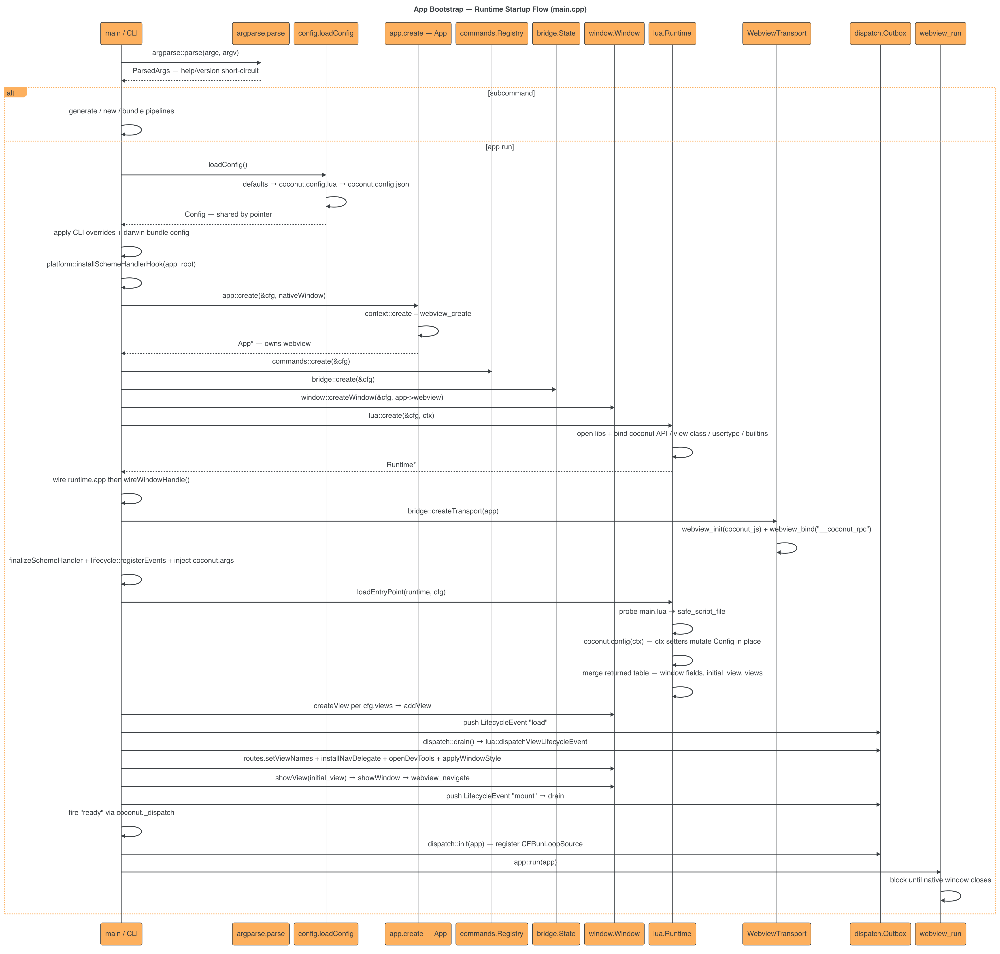

## Shutdown

The window closing returns from `webview_run()`, then `dispatch::shutdown` flushes the

queue and `app::destroy` tears down modules in dependency order — commands before Lua

(they hold `sol::function` references), webview last.

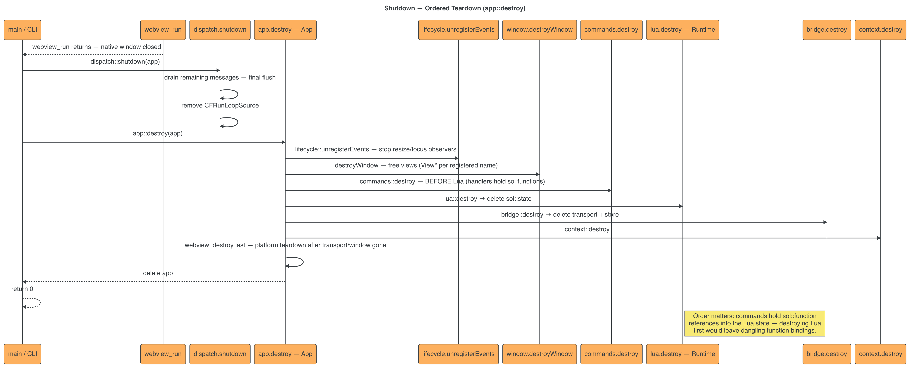

## Config Resolution

One shared `Config` pointer flows through every module. Precedence per field:

defaults < config file < CLI flags < `coconut.config(ctx)` setters/table.

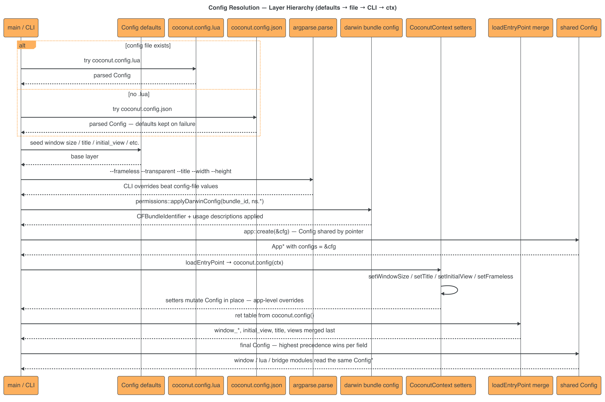

## Command Dispatch (Main Thread)

The class-level path for `coconut.call()`: the `__coconut_rpc` webview binding →

`WebviewTransport::handleCall` → `commands::Registry` → Lua handler → `webview_return`.

In v0.1.1 commands registered with `ctx:bind` are invoked on the main thread.

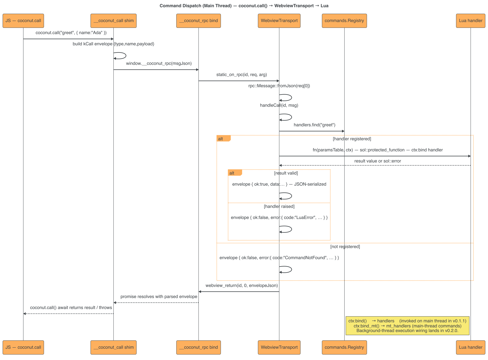

## Background Command Execution

Two lock-free SPSC `Outbox` queues (capacity 64 each) connect main ↔ background thread.

The background thread runs its own Lua VM. The machinery ships in v0.1.1; wiring

`ctx:bind` to the background thread is completed in v0.2.0.

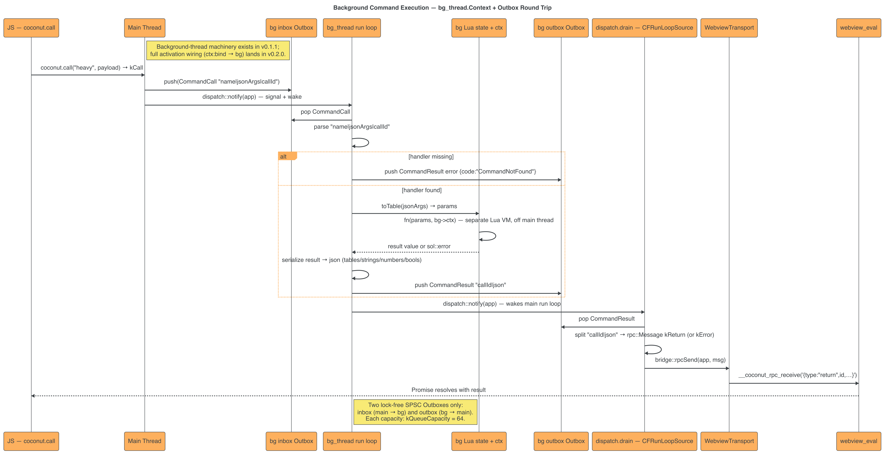

## View Switching

`ctx.window.show(name)` fires `mount`/`unmount` lifecycle events through the dispatch

queue and navigates the webview. `load` is guarded to fire once per view.

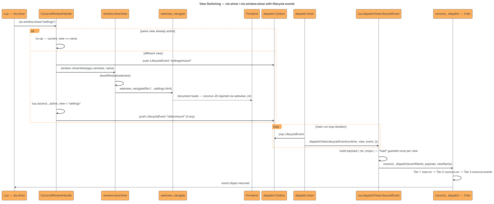

## Window Control

`CoconutWindowHandle` never touches platform APIs directly — it goes through the

`window` interface module to the per-OS implementation (AGENTS.md adapter rule).

`close()` is veto-able via `coconut._dispatch("close", …)` + `preventDefault()`.

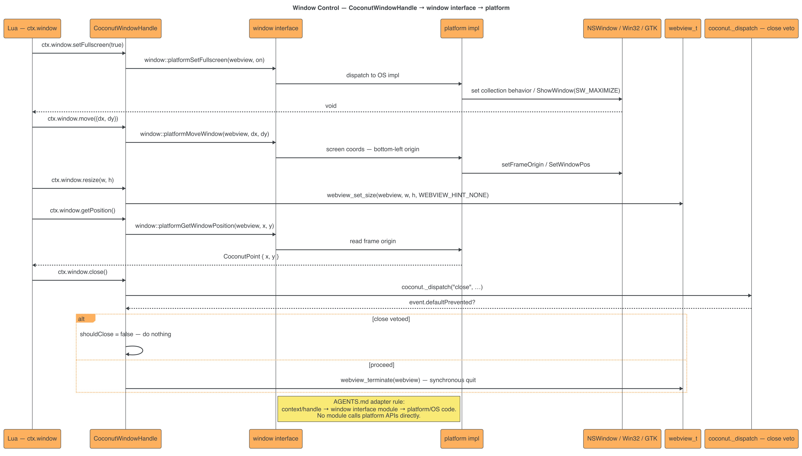

## Platform Adapter

`coconut.dialog` / `notify` / `clipboard` / `openurl` / `store` register real closures on

the main thread and warning stubs on the background thread (`ThreadKind`).

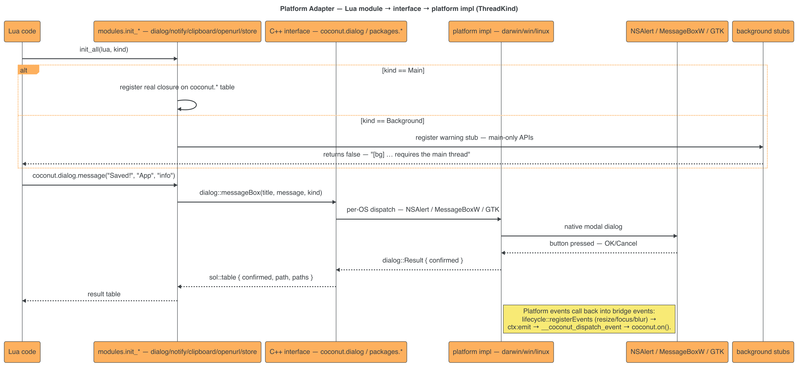

## Hot Reload

`coconut.hotreload()` compares mtimes, optionally regenerates `.g.lua` glue, clears

`package.loaded`, and re-runs the module's `register(ctx)` function — all synchronously

on the main thread in v0.1.x.

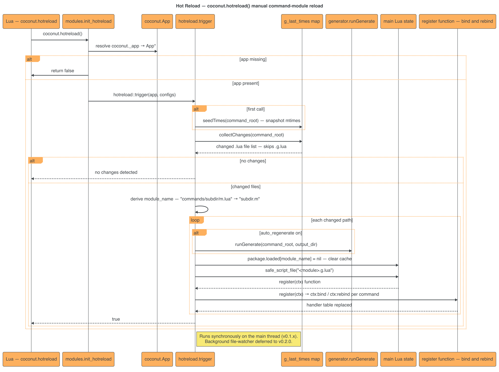

## Bridge Communication

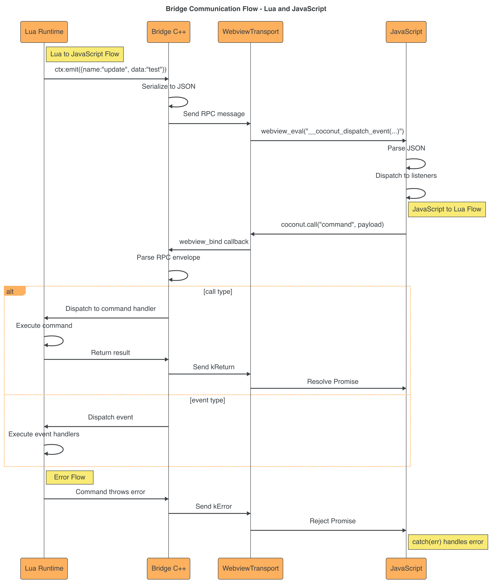

## RPC Call

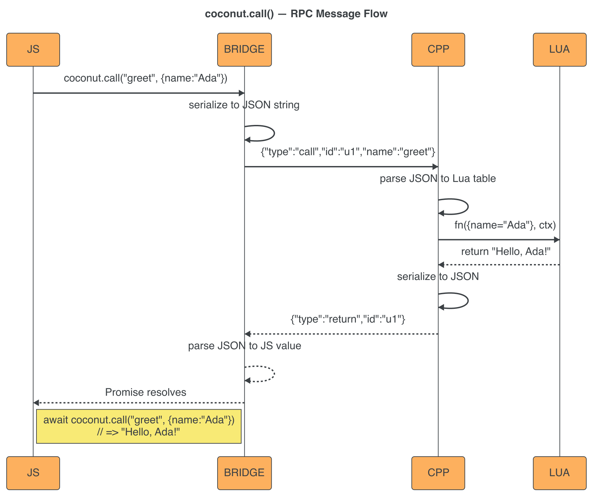

## Event Flow

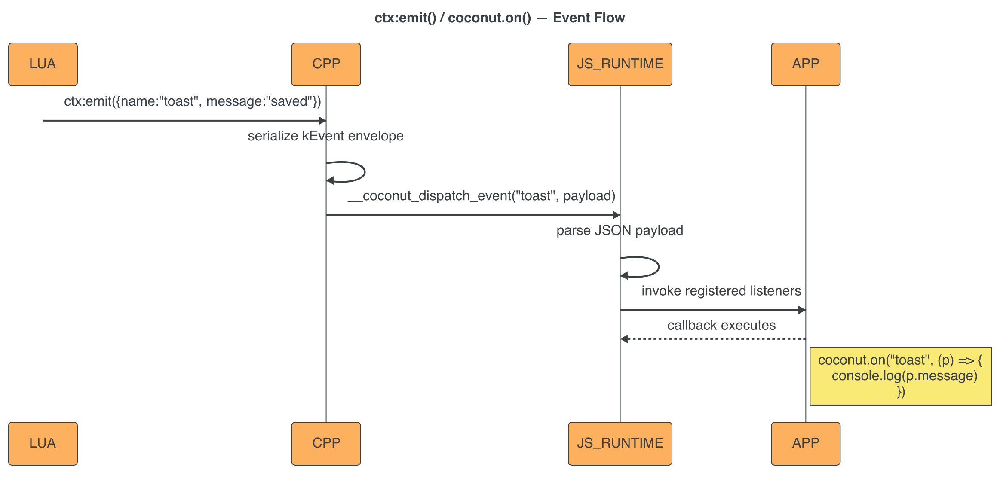

## Event Dispatch Chain

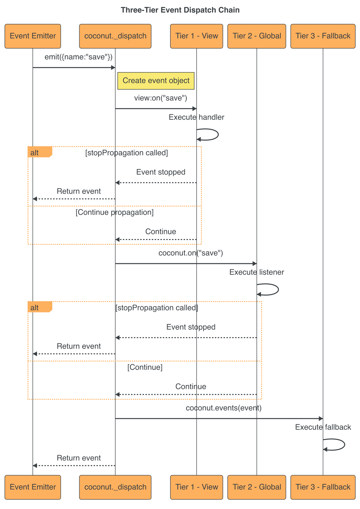

## Keybind Dispatch

## Scheme Flow

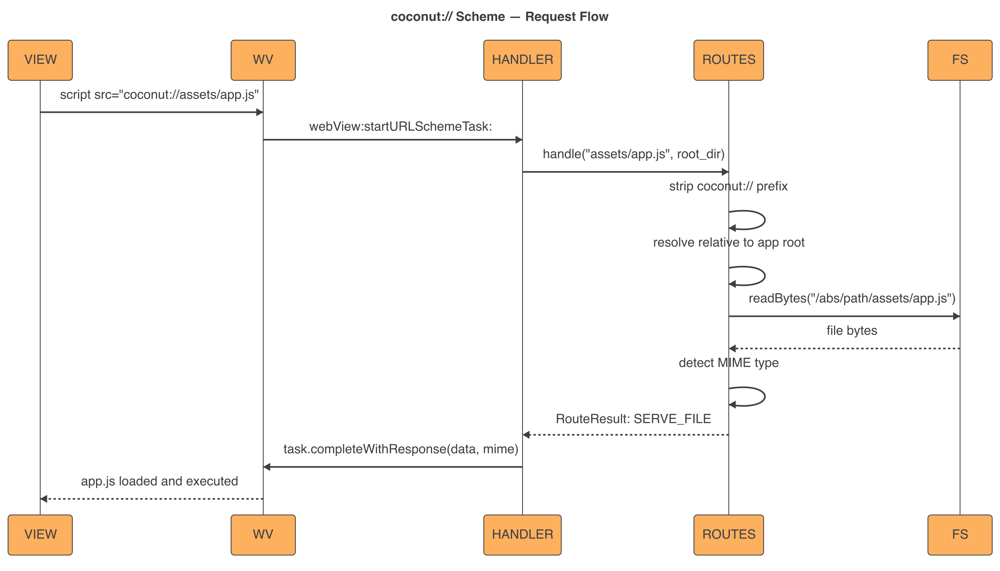

## Generator

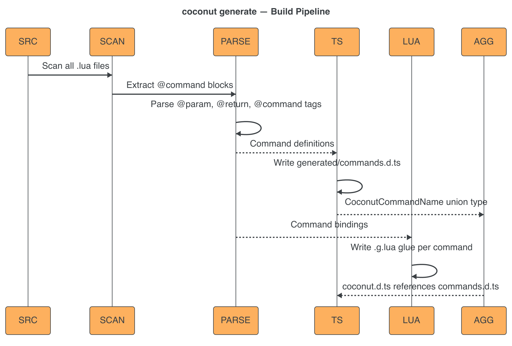

## Architecture

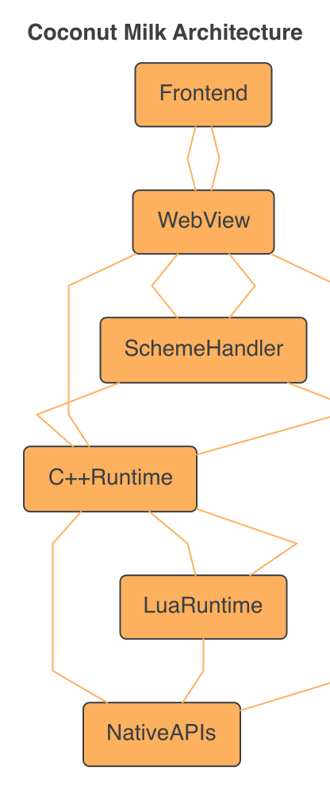
